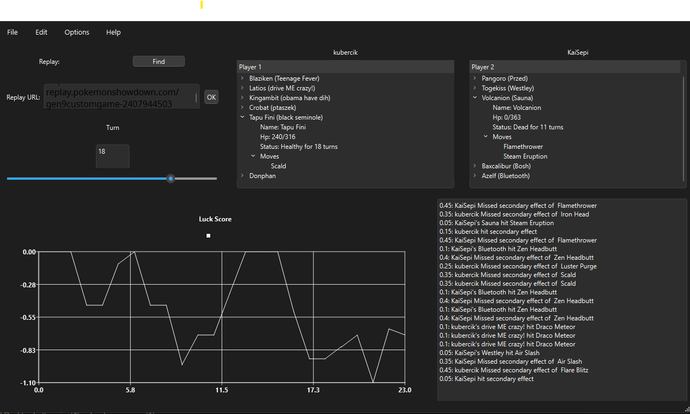

# ShowRep:
## App used to get info from your [Pokemon Showdown](https://play.pokemonshowdown.com/) replays! 

## Install:
- On Windows, you can select the latest release and download the .zip file containing a (maybe) working folder with a (maybe) working showrep.exe file

If you decide to deploy manually, you can open the project in the Qt and do the following:
- Build the project using the release configuration
- Depending on your system, use `windeployqt` or `linuxdeployqt` to create an executable:
`C:\Qt\<Qt version>\mingw_64\bin\windeployqt.exe build\<build folder>\mainapp.exe`

# How to use:

To start, open the app and enter your replay file [TODO: add other ways of replay input],
then watch the magic!

The app calculates (very naively so far) how lucky you or you opponent were during the battle by a variety of metrics:
- move accuracy
- secondary effect accuracy
- critical hits
- [TODO] there has to be something more

Exemplary analysed replay: (very early and WIP)

